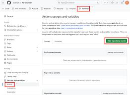

---
tags:
- アニメ
- ゲーム
---

Blogを表示できたら成功｡

\#アニメ




この文が挿入されていたら成功

*ReadItLater* *Youtube*

# [笹川真生 - 日本の九月の気層です / Mao Sasagawa - Japan's September Air Layer](https://www.youtube.com/watch?v=4-3Ogspng1I&list=RDRcDBofJ-_oA&index=12)

<iframe width="560" height="315" src="https://www.youtube-nocookie.com/embed/4-3Ogspng1I" title="YouTube video player" frameborder="0" allow="accelerometer; autoplay; clipboard-write; encrypted-media; gyroscope; picture-in-picture" allowfullscreen></iframe>

Markdownの構文一覧

 > 
 > 引用
 > 
 >  > 
 >  > 引用のネスト
 >  > あふぁds

image


**bold**

*itaric*

`code`

~~cancel~~

---

# タイトル

|test|table|
|----|-----|
|row|aaa|

* list
  * nest
* aaa

1. number
1. test
   1. i
   1. ii
   1. iii
   1. iv
   1. v

codeblock

````typescript
const [number,setNumber] =useState(0)

export default funciton home ():ReactElement {
	return(
		<h1> home page </h1>
		{number}
	)
}
````

LinkCard
